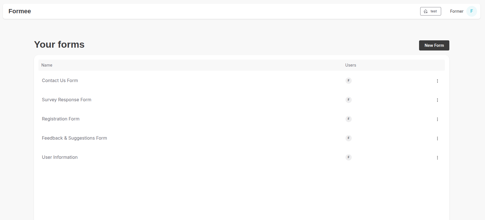

# Formee

Formee is an application written in Next.js that allows you to handle forms and provides you with full end-to-end encryption using <b>[PrivMX Bridge](https://privmx.dev)</b>.



## Features

Formee provides essential form features, including text data and file attachments. All the data exchanged within Formee is end-to-end encrypted, meaning that only the end users can read (decrypt) the form responses. It means that even the platform hosting
provider cannot access user data.

---

## Basics

Formee consist of two parts: **Web Application** and **Server Backend** (both written in Next.js).
**Server Backend** manages **user accounts** and utilizes MongoDB for persistent data storage.

All the sent form entries and files are managed by <b>[PrivMX Bridge](https://privmx.dev)</b>, to ensure they are properly
encrypted and are not stored in your server environment.

## Requirements

-   Node.js in 20.10 version.
-   MongoDB instance or Docker, which allows to run our docker compose file to run the database.
-   PrivMX Bridge Instance and Docker for running it.

## How to Start?

1. To begin, clone this repository. It includes the Formee sources along with various helpful files.
2. Copy or rename `./.env.example` to `./.env.local`. `.env.example` contains essential variables and/or placeholders. All environmental variables for local development should be put there, including MongoDB connection string, PrivMX Bridge URL, API Keys, PrivMX Solution & Context IDs. You can find more information about these variables in the following sections.


### Start Bridge Instance

> To proceed, ensure that Docker is up and running.

To run Formee successfully, you need to have a running [PrivMX Bridge instance](https://github.com/simplito/privmx-bridge). PrivMX Bridge is a service that provides end-to-end encryption for your communication. It is a crucial part of Formee's architecture.

**Important:** If you already have a PrivMX Bridge Docker instance running on your machine, you **should not** create a new one. Instead, use your existing instance.

If you don't have a running instance, clone the [PrivMX Bridge Docker](https://github.com/simplito/privmx-bridge-docker) repository to set up a PrivMX Bridge instance locally. Follow the instructions included in its README. The PrivMX Bridge startup process will create all necessities required to run Formee, with end-to-end encryption, including essential ENV variables. After initialization, the terminal will output the following:

-   **PrivMX Bridge URL** - address of the running PrivMX Bridge instance;
-   **API Key ID** and **API Key Secret** - used to authorize Formee requests to PrivMX Bridge;
-   **Solution ID** - ID of the created Solution;
-   **Context ID** - ID of one of the Contexts inside the Solution.

Paste them into the `./env.local` file created earlier.

> If you want to know more about PrivMX Bridge, visit our documentation [here](https://docs.privmx.dev/).


#### JWT Salt

Generate a random **JWT_SALT** using e.g. `openssl`:

```sh
openssl rand -base64 20
```

and paste it into your `.env.local`.

```ENV
JWT_SALT=GENERATED_RANDOM_SECRET
```

#### Next Public Backend URL

For demo purposes, Formee runs in localhost (port 3000). `NEXT_PUBLIC_BACKEND_URL` configures the app's default address. In the production environment, you can use a fully qualified domain name.

```ENV
NEXT_PUBLIC_BACKEND_URL=http://localhost:3000
```

### Start MongoDB Instance

You need a **MongoDB** Instance with replica sets for transactions.

> To proceed, ensure that Docker is up and running.

For demo purpose, you can use the `docker-compose-mongo.yml` from this repository. Run the following command to start MongoDB Docker in your local environment:

```sh
docker-compose -f docker-compose-mongo.yml up
```

It will create a MongoDB instance running on `0.0.0.0:27017` with a replica set named **rs0**.

While using Docker and the provided `docker-compose-mongo.yml` file, you can use the following lines describing connection to your local MongoDB database:

```ENV
REPLICA_SET=rs0
MONGODB_URI=mongodb://127.0.0.1:27017/?replicaSet=$REPLICA_SET
```

Feel free to adjust these settings if you opt for a custom setup.


## Running the App

In a new terminal, go to the project root folder.

```sh
npm install
npm run dev
```

During the first run, the Formee server will create the first invitation token. It's important to **copy and save it somewhere**, it will be used for login.
Go to <http://localhost:3000/sign-up> and create the first Staff user. 

#### IMPORTANT
If you lose your initial invitation token, you'll need to reset your `Formee` database to generate a new one.

**If your MongoDB instance is running in Docker you can do this with the following command:**

```
docker exec -it <your_mongo_container_name> mongosh --eval "use Formee; db.InviteTokens.drop()"
```

**If your MongoDB instance is running locally (not Dockerized):**

Use the following command:
```
mongosh --eval "use Formee; db.InviteTokens.drop()"
```


### Submitting Responses

To send a response, first, you need to create a Form inside Formee. Next, you have to prepare a form inside your app/website to collect and send data.
You can check examples inside `/examples/` folder that show it should be done.

### Production Notes

#### Alternative ways to use our docker-compose-production.yml

1. Create the same .env file but name it **.env.production**.
2. Run docker-compose. Variable `PORT` will define on which port it will be available.

```sh
   PORT=PORT_NUMER_OF_APPLICATION docker-compose -f docker-compose-production.yml up
```

## License

[MIT](./LICENSE)
